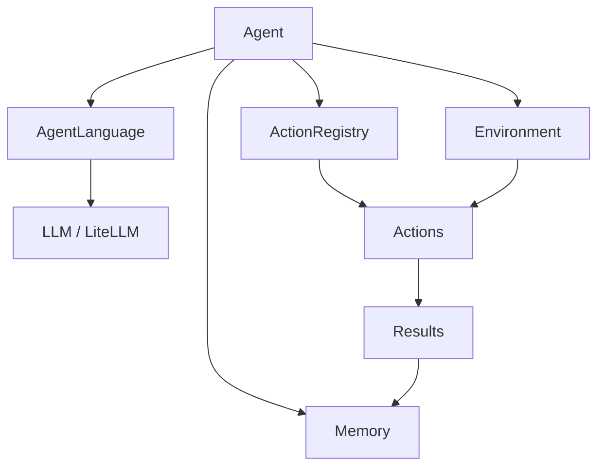

# AI Agents Development Framework - Test Project

Test Project for Python AI Agents Development. This project provides a modular and extensible framework for building intelligent agents that can interact with their environment, maintain memory, and work towards specific goals using LLMs.

## 🏗️ Architecture Overview

The framework is built on several core components that work together in a feedback loop (Think → Act → Observe).



## 🧩 Core Components

All framework components are consolidated in `src/game_framework/framework.py` for simplicity and ease of use.

| Component | Description |
| :--- | :--- |
| **Agent** | The orchestrator that manages the loop, interacts with the LLM, and executes actions. |
| **AgentLanguage** | Abstract base class for defining how the agent communicates with the LLM (e.g., Function Calling). |
| **ActionRegistry** | A container for all `Action` objects available to the agent. |
| **Memory** | Stores the conversation history and environment results to provide context for the next step. |
| **Environment** | The interface through which the agent interacts with the outside world. |
| **Goal** | Defines what the agent is trying to achieve. |

## 🚀 Getting Started

### 1. Setup

```bash
# Install dependencies
pip install -r requirements.txt
```

### 2. Configuration

The framework uses `litellm` for LLM interactions. Ensure you have the necessary environment variables set for your chosen provider (e.g., `GROQ_API_KEY`).

### 3. Usage Example

Review `src/game_framework/main.py` for a complete example of setting up an agent to read project files.

```python
from framework import Agent, ActionRegistry, Environment, Goal

# Define goals
goals = [Goal(priority=1, name="Gather Info", description="Read setup.py")]

# Initialize and run
agent = Agent(goals, language, registry, generate_response, environment)
agent.run("Read setup.py and summarize it.")
```

## 🧪 Testing

Run tests using `pytest`:

```bash
pytest
```

## 📄 License

[License details go here]
